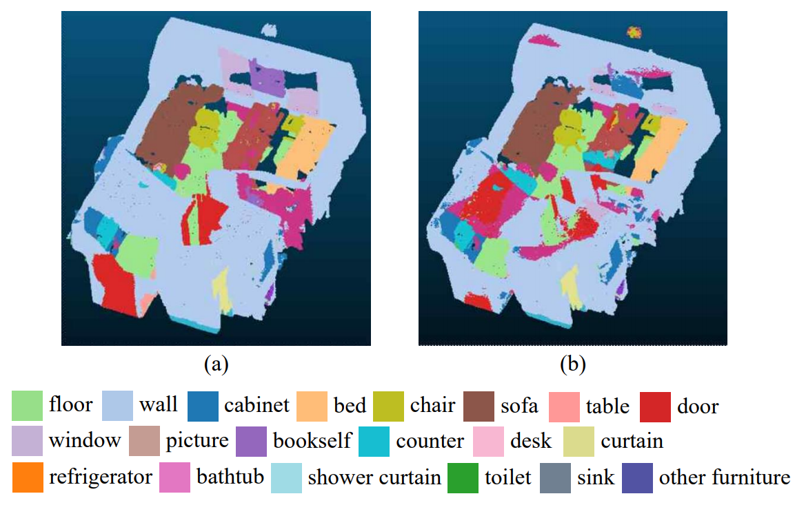
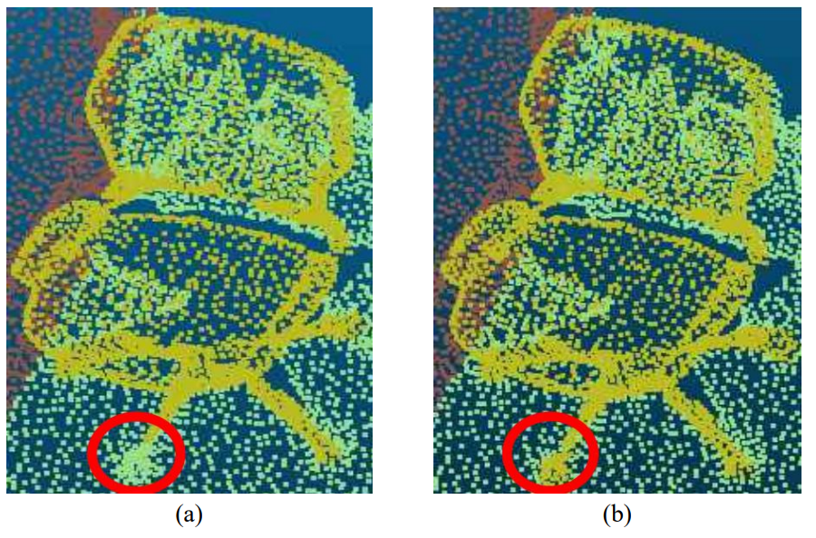

# Performance Analysis of 3D Semantic Segmentation using 3D Gaussian Splatting

[](https://nanolithography.spiedigitallibrary.org/conference-proceedings-of-spie/14072/1407206/Performance-analysis-of-3D-semantic-segmentation-using-3D-Gaussian-splatting/10.1117/12.3102151.short)
[](https://doi.org/10.1117/12.3102151)

**Gahyeon Kim**, Dong-hun Lee, Chae-yeong Song, Hojun Song, and Sang-hyo Park  
Kyungpook National University, Republic of Korea

---

<p align="center">
  
</p>

## Overview

This repository provides the code for the paper  
**"Performance Analysis of 3D Semantic Segmentation using 3D Gaussian Splatting."**

This work investigates the effectiveness of **3D Gaussian Splatting (3DGS)** as a scene representation for downstream **3D semantic segmentation**.

Starting from RGB-D images and camera parameters in the ScanNet dataset, we construct an initial point cloud and optimize it using 3D Gaussian Splatting. Since Gaussian primitives do not directly contain semantic labels or normal vectors, geometric and semantic attributes are transferred from the original ScanNet point cloud using a **K-Nearest Neighbor (KNN)** based propagation strategy.

The resulting 3DGS representation is converted into a Pointcept-compatible format and evaluated using **Point Transformer** and **MinkUNet**.

---

## Pipeline

The overall pipeline consists of the following stages:

1. Construct an initial point cloud from ScanNet RGB-D images and camera poses.
2. Optimize the scene representation using 3D Gaussian Splatting.
3. Apply voxelization to regularize the density of Gaussian points.
4. Transfer color, normal, and semantic attributes from the original ScanNet point cloud using KNN.
5. Convert the processed Gaussian point set into a Pointcept-compatible representation.
6. Evaluate semantic segmentation performance using Point Transformer and MinkUNet.

For semantic label propagation, labels are determined using majority voting among neighboring points. A semantic label is assigned when the dominant class accounts for more than **60%** of the selected neighbors.

---

## Method

### 3DGS Preprocessing

ScanNet RGB-D images and camera parameters are used to generate an initial point cloud.

For each frame, the depth map is back-projected into 3D space using the camera intrinsic parameters, and the points are transformed into the world coordinate system using the corresponding camera poses.

The resulting point cloud is used to initialize the 3D Gaussian representation.

Each Gaussian primitive contains:

- 3D position
- Color
- Covariance
- Opacity

### Voxelization

To regularize the Gaussian point distribution, the optimized 3DGS point cloud is voxelized at two resolutions:

- **2 cm**
- **4 cm**

Voxelization reduces redundant points while preserving spatial information required for semantic segmentation.

### KNN-based Attribute Transfer

Gaussian primitives do not directly contain semantic labels or surface normals.

For each Gaussian point, K-nearest neighbors are retrieved from the corresponding labeled ScanNet point cloud.

The attributes are transferred as follows:

- **Color:** averaged from neighboring points
- **Normal:** averaged from neighboring points
- **Semantic label:** determined by majority voting
- **Confidence threshold:** 0.6

The resulting Gaussian point representation contains geometric and semantic information for downstream semantic segmentation.

---

## Environment Setup

### 1. Clone the Repository

```bash
git clone https://github.com/kgh1234/SPIE-3DGS-Semantic.git
cd SPIE-3DGS-Semantic
```

### 2. Install Dependencies

Install the required Python packages:

```bash
pip install -r requirements.txt
```

The experiments reported in the paper were conducted using a single **NVIDIA RTX 3080 GPU**.

---

## Dataset

Experiments are conducted on the **ScanNet** dataset.

ScanNet data are not included in this repository and should be downloaded and prepared separately.

The expected data paths can be configured in `config.json`:

```json
{
  "input_root": "./data/scannet",
  "output_root": "./outputs/scannet_uncertainty",
  "path_3dgs_root": "./data/scannet-3DGS",
  "meta_root": "./meta"
}
```

A recommended directory structure is:

```text
SPIE-3DGS-Semantic/
├── data/
│   ├── scannet/
│   └── scannet-3DGS/
├── meta/
├── outputs/
└── ...
```

Raw ScanNet data, generated point clouds, `.ply` files, and intermediate outputs are not included in this repository.

---

## Code Structure

```text
.
├── 3DGS-only.py
├── 3DGS-only-uncertainty.py
├── 3DGS-only_ply-save.py
├── PC-3DGS_fusion.py
├── PC-3DGS_fusion_single.py
├── PC-3DGS_geo-fusion.py
│
├── attribute_utils.py
├── fusion_utils.py
├── gp_utils.py
├── gp_utils_gpu.py
├── pruning.py
│
├── config.json
├── requirements.txt
│
├── meta/
│   ├── scannetv2_train.txt
│   ├── scannetv2_val.txt
│   ├── temp_scannet.txt
│   ├── train100_samples.txt
│   └── valid20_samples.txt
│
├── analysis/
├── sampling_test/
├── validation/
├── visualization/
└── assets/
```

The repository contains utilities for 3DGS point processing, voxelization, KNN-based attribute propagation, point-cloud/3DGS fusion, validation, and visualization.

---

## Semantic Segmentation

The processed Gaussian point sets are serialized into a representation compatible with the **Pointcept** framework.

We evaluate two semantic segmentation backbones:

- **Point Transformer**
- **MinkUNet**

The segmentation models are configured and trained separately using Pointcept.

---

## Experimental Results

### Point Transformer

| Train | Validation | Voxel Size | mIoU ↑ | mAcc ↑ | allAcc ↑ |
|---|---|---:|---:|---:|---:|
| ScanNet | ScanNet | 2 cm | 77.0 | 84.3 | 92.0 |
| 3DGS | ScanNet | 4 cm | 71.2 | 78.4 | 88.7 |
| 3DGS | 3DGS | 4 cm | 69.0 | 73.9 | **93.5** |
| 3DGS | ScanNet | 2 cm | **77.1** | **85.1** | 90.9 |
| 3DGS | 3DGS | 2 cm | 72.3 | 80.4 | 89.2 |

### MinkUNet

| Train | Validation | Voxel Size | mIoU ↑ | mAcc ↑ | allAcc ↑ |
|---|---|---:|---:|---:|---:|
| ScanNet | ScanNet | 4 cm | **76.2** | **83.9** | **91.5** |
| 3DGS | 3DGS | 4 cm | 75.7 | 82.9 | 90.9 |
| 3DGS | ScanNet | 4 cm | 61.8 | 70.3 | 84.6 |
| ScanNet | 3DGS | 4 cm | 65.2 | 73.2 | 86.6 |

The results demonstrate that 3DGS can preserve structural information useful for semantic segmentation.

For Point Transformer, 3DGS-based training with a 2 cm voxel size achieves competitive performance when evaluated on ScanNet. For MinkUNet, training and validation within the same 3DGS domain achieves performance close to the ScanNet baseline.

However, performance decreases substantially in cross-domain settings, indicating a representation gap between conventional ScanNet point clouds and 3DGS-based point sets.

---

## Qualitative Results

### Scene-level Semantic Segmentation

<p align="center">
  
</p>

<p align="center">
  <sub>
    (a) ScanNet-trained baseline &nbsp;&nbsp;&nbsp;
    (b) 3DGS-trained model
  </sub>
</p>

The ScanNet baseline provides more stable global semantic segmentation, with clearer boundaries between major structural elements.

The 3DGS-trained model shows increased ambiguity around some object boundaries, indicating limitations in global semantic consistency.

### Fine-grained Geometry

<p align="center">
  
</p>

<p align="center">
  <sub>
    (a) ScanNet-trained baseline &nbsp;&nbsp;&nbsp;
    (b) 3DGS-trained model
  </sub>
</p>

Despite reduced global semantic consistency, the 3DGS-based representation better preserves fine-grained geometric structures such as chair legs.

This result highlights a trade-off between detailed geometric representation and global semantic consistency.

---

## Main Findings

Our experiments show that **3DGS is a viable representation for semantic-level 3D learning**, but its effectiveness depends on the relationship between the training and evaluation domains.

3DGS-based representations preserve fine-grained geometric structures effectively, while semantic segmentation performance can become unstable when conventional point-cloud and Gaussian-based representations are mixed across training and validation.

These observations suggest that additional structured semantic constraints may be beneficial for improving semantic consistency and domain generalization in 3DGS-based scene representations.

---

## Paper

**Performance Analysis of 3D Semantic Segmentation using 3D Gaussian Splatting**

Gahyeon Kim, Dong-hun Lee, Chae-yeong Song, Hojun Song, and Sang-hyo Park.

- **SPIE Digital Library:** [Paper](https://nanolithography.spiedigitallibrary.org/conference-proceedings-of-spie/14072/1407206/Performance-analysis-of-3D-semantic-segmentation-using-3D-Gaussian-splatting/10.1117/12.3102151.short)
- **DOI:** [10.1117/12.3102151](https://doi.org/10.1117/12.3102151)

---


## Citation

If you find this work useful, please cite:

```bibtex
@inproceedings{10.1117/12.3102151,
  author = {Gahyeon Kim and Dong-hun Lee and Chae-yeong Song and Hojun Song and Sang-hyo Park},
  title = {{Performance analysis of 3D semantic segmentation using 3D Gaussian splatting}},
  volume = {14072},
  booktitle = {International Workshop on Advanced Imaging Technology (IWAIT) 2026},
  editor = {Masayuki Nakajima and Chuan-Yu Chang and Chien-Chou Lin and Shogo Tokai and Kwang-Deok Seo and Chia-Hung Yeh and Budianto Tandianus},
  organization = {International Society for Optics and Photonics},
  publisher = {SPIE},
  pages = {1407206},
  keywords = {3D Gaussian Splatting, 3D Semantic Segmentation, Scene Representation, Point Cloud},
  year = {2026},
  doi = {10.1117/12.3102151},
  URL = {https://doi.org/10.1117/12.3102151}
}
```
