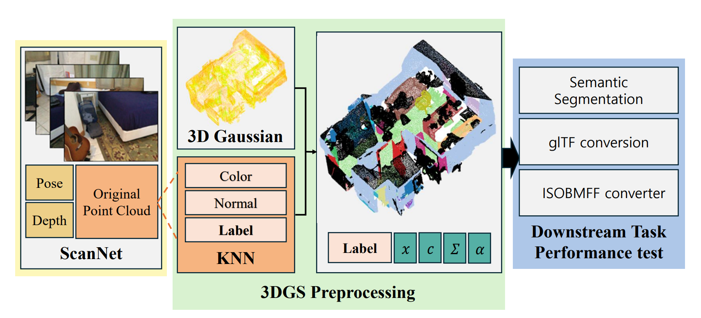

# Performance Analysis of 3D Semantic Segmentation using 3D Gaussian Splatting

[](https://nanolithography.spiedigitallibrary.org/conference-proceedings-of-spie/14072/1407206/Performance-analysis-of-3D-semantic-segmentation-using-3D-Gaussian-splatting/10.1117/12.3102151.short)
[](https://doi.org/10.1117/12.3102151)

**Gahyeon Kim**, Dong-hun Lee, Chae-yeong Song, Hojun Song, and Sang-hyo Park  
Kyungpook National University, Republic of Korea

---

<p align="center">
  
</p>

## Overview

This repository provides the code for the paper  
**"Performance Analysis of 3D Semantic Segmentation using 3D Gaussian Splatting."**

This work investigates the effectiveness of **3D Gaussian Splatting (3DGS)** as a scene representation for downstream **3D semantic segmentation**.

Starting from RGB-D images and camera parameters in the ScanNet dataset, we construct an initial point cloud and optimize it using 3D Gaussian Splatting. Since Gaussian primitives do not directly contain semantic labels or normal vectors, geometric and semantic attributes are transferred from the original ScanNet point cloud using a **K-Nearest Neighbor (KNN)** based propagation strategy.

The resulting 3DGS representation is converted into a Pointcept-compatible format and evaluated using **Point Transformer** and **MinkUNet**.

---

## Pipeline

The overall pipeline consists of the following stages:

1. Construct an initial point cloud from ScanNet RGB-D images and camera poses.
2. Optimize the scene representation using 3D Gaussian Splatting.
3. Apply voxelization to regularize the density of Gaussian points.
4. Transfer color, normal, and semantic attributes from the original ScanNet point cloud using KNN.
5. Convert the processed Gaussian point set into a Pointcept-compatible representation.
6. Evaluate semantic segmentation performance using Point Transformer and MinkUNet.

For semantic label propagation, labels are determined using majority voting among neighboring points. A semantic label is assigned when the dominant class accounts for more than **60%** of the selected neighbors.

---

## Method

### 3DGS Preprocessing

ScanNet RGB-D images and camera parameters are used to generate an initial point cloud.

For each frame, the depth map is back-projected into 3D space using the camera intrinsic parameters, and the points are transformed into the world coordinate system using the corresponding camera poses.

The resulting point cloud is used to initialize the 3D Gaussian representation.

Each Gaussian primitive contains:

- 3D position
- color
- covariance
- opacity

The Gaussian parameters are optimized using multi-view images.

### Voxelization

Indoor scenes often contain highly non-uniform point densities due to variations in camera distance and scene geometry.

To regularize the Gaussian point distribution, the optimized 3DGS point cloud is voxelized at two resolutions:

- **2 cm**
- **4 cm**

Voxelization reduces redundant points while preserving the spatial structure required for semantic segmentation.

### KNN-based Attribute Transfer

Unlike conventional labeled point clouds, Gaussian primitives do not directly contain semantic labels or surface normals.

For each Gaussian point, K-nearest neighbors are retrieved from the corresponding labeled ScanNet point cloud.

The attributes are transferred as follows:

- **Color:** averaged from neighboring points
- **Normal:** averaged from neighboring points
- **Semantic label:** determined by majority voting
- **Confidence threshold:** 0.6

The resulting Gaussian point representation contains both geometric and semantic information required for downstream segmentation.

---

## Environment Setup

Clone the repository:

```bash
git clone https://github.com/kgh1234/SPIE-3DGS-Semantic.git
cd SPIE-3DGS-Semantic
